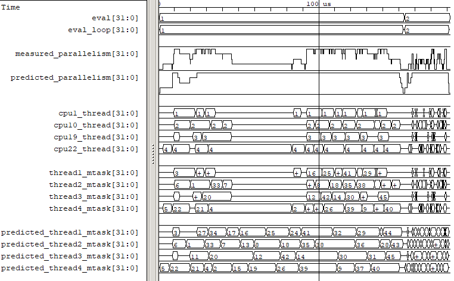

.. Copyright 2003-2024 by Wilson Snyder.
.. SPDX-License-Identifier: LGPL-3.0-only OR Artistic-2.0

verilator_gantt
===============

Verilator_gantt creates a visual representation to help analyze Verilator
multithreaded simulation performance by showing when each macro-task
starts, ends, and when each thread is busy or idle.

For an overview of the use of verilator_gantt, see :ref:`Profiling`.

Gantt Chart VCD
---------------

Verilated_gantt creates a value change dump (VCD) format dump file which
may be viewed in a waveform viewer (e.g., C<GTKWave>):

   Example verilator_gantt output, as viewed with GTKWave.

The viewed waveform chart has time on the X-axis, with one unit for each
time tick of the system's high-performance counter.

Gantt Chart VCD Signals
-----------------------

In waveforms, there are the following signals. In GTKWave, use "decimal"
data format to remove the leading zeros and make the traces easier to read.

trace/section
  Shows the name of the current top of the execution section stack.
  Set GTKWave data format to "ASCII".

trace/depth
  Shows the depth of the execution section stack.
  Set GTKWave data format to "Analog".

measured_parallelism
  The number of mtasks active at this time, for best performance, this will
  match the thread count. In GTKWave, use a data format of "analog step" to
  view this signal.

predicted_parallelism
  The number of mtasks Verilator predicted would be active at this time,
  for best performance this will match the thread count. In GTKWave, use a
  data format of "analog step" to view this signal.

cpu#_thread
  For the given CPU number, the thread number measured to be executing.

mtask#_cpu
  For the given mtask id, the CPU it was measured to execute on.

thread#_mtask
  For the given thread number, the mtask id it was executing.

predicted_thread#_mtask
  For the given thread number, the mtask id Verilator predicted would be
  executing.

verilator_gantt Arguments
-------------------------

.. program:: verilator_gantt

.. option:: <filename>

The filename to read data from; the default is "profile_exec.dat".

.. option:: --help

Displays a help summary, the program version, and exits.

.. option:: --no-vcd

Disables creating a .vcd file.

.. option:: --vcd <filename>

Sets the output filename for vcd dump; the default is "verilator_gantt.vcd".
