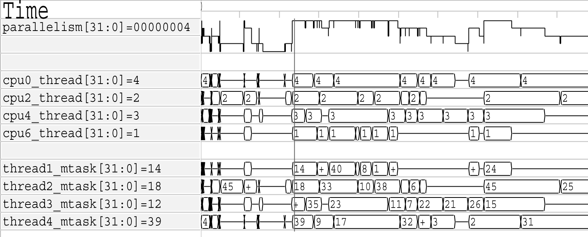

.. Copyright 2003-2022 by Wilson Snyder.
.. SPDX-License-Identifier: LGPL-3.0-only OR Artistic-2.0

.. _Simulating:

************************************
Simulating (Verilated-Model Runtime)
************************************

This section describes items related to simulating, that is, the use of a
Verilated model's executable.  For the runtime arguments to a simulated
model, see :ref:`Simulation Runtime Arguments`.

.. _Benchmarking & Optimization:

Benchmarking & Optimization
===========================

For best performance, run Verilator with the :vlopt:`-O3`
:vlopt:`--x-assign fast <--x-assign>` :vlopt:`--x-initial fast
<--x-initial>` :vlopt:`--noassert <--assert>` options.  The :vlopt:`-O3`
option will require longer time to run Verilator, and :vlopt:`--x-assign
fast <--x-assign>` :vlopt:`--x-initial fast <--x-assign>` may increase the
risk of reset bugs in trade for performance; see the above documentation
for these options.

If using Verilated multithreaded, use ``numactl`` to ensure you are using
non-conflicting hardware resources. See :ref:`Multithreading`. Also
consider using profile-guided optimization, see :ref:`Thread PGO`.

Minor Verilog code changes can also give big wins.  You should not have any
UNOPTFLAT warnings from Verilator.  Fixing these warnings can result in
huge improvements; one user fixed their one UNOPTFLAT warning by making a
simple change to a clock latch used to gate clocks and gained a 60%
performance improvement.

Beyond that, the performance of a Verilated model depends mostly on your
C++ compiler and size of your CPU's caches. Experience shows that large
models are often limited by the size of the instruction cache, and as such
reducing code size if possible can be beneficial.

The supplied $VERILATOR_ROOT/include/verilated.mk file uses the OPT,
OPT_FAST, OPT_SLOW and OPT_GLOBAL variables to control optimization. You
can set these when compiling the output of Verilator with Make, for
example:

.. code-block:: bash

     make OPT_FAST="-Os -march=native" -f Vour.mk Vour__ALL.a

OPT_FAST specifies optimization options for those parts of the model that
are on the fast path. This is mostly code that is executed every
cycle. OPT_SLOW applies to slow-path code, which executes rarely, often
only once at the beginning or end of simulation. Note that OPT_SLOW is
ignored if VM_PARALLEL_BUILDS is not 1, in which case all generated code
will be compiled in a single compilation unit using OPT_FAST. See also the
Verilator :vlopt:`--output-split` option. The OPT_GLOBAL variable applies
to common code in the runtime library used by Verilated models (shipped in
$VERILATOR_ROOT/include). Additional C++ files passed on the verilator
command line use OPT_FAST. The OPT variable applies to all compilation
units in addition to the specific "OPT" variables described above.

You can also use the :vlopt:`-CFLAGS` and/or :vlopt:`-LDFLAGS` options on
the verilator command line to pass arguments directly to the compiler or
linker.

The default values of the "OPT" variables are chosen to yield good
simulation speed with reasonable C++ compilation times. To this end,
OPT_FAST is set to "-Os" by default. Higher optimization such as "-O2" or
"-O3" may help (though often they provide only a very small performance
benefit), but compile times may be excessively large even with medium sized
designs. Compilation times can be improved at the expense of simulation
speed by reducing optimization, for example with OPT_FAST="-O0". Often good
simulation speed can be achieved with OPT_FAST="-O1 -fstrict-aliasing" but
with improved compilation times. Files controlled by OPT_SLOW have little
effect on performance and therefore OPT_SLOW is empty by default
(equivalent to "-O0") for improved compilation speed. In common use-cases
there should be little benefit in changing OPT_SLOW.  OPT_GLOBAL is set to
"-Os" by default and there should rarely be a need to change it. As the
runtime library is small in comparison to a lot of Verilated models,
disabling optimization on the runtime library should not have a serious
effect on overall compilation time, but may have detrimental effect on
simulation speed, especially with tracing. In addition to the above, for
best results use OPT="-march=native", the latest Clang compiler (about 10%
faster than GCC), and link statically.

Generally the answer to which optimization level gives the best user
experience depends on the use case and some experimentation can pay
dividends. For a speedy debug cycle during development, especially on large
designs where C++ compilation speed can dominate, consider using lower
optimization to get to an executable faster. For throughput oriented use
cases, for example regressions, it is usually worth spending extra
compilation time to reduce total CPU time.

If you will be running many simulations on a single model, you can
investigate profile guided optimization. See :ref:`Compiler PGO`.

Modern compilers also support link-time optimization (LTO), which can help
especially if you link in DPI code. To enable LTO on GCC, pass "-flto" in
both compilation and link. Note LTO may cause excessive compile times on
large designs.

Unfortunately, using the optimizer with SystemC files can result in
compilation taking several minutes. (The SystemC libraries have many little
inlined functions that drive the compiler nuts.)

If you are using your own makefiles, you may want to compile the Verilated
code with ``--MAKEFLAGS -DVL_INLINE_OPT=inline``. This will inline
functions, however this requires that all cpp files be compiled in a single
compiler run.

You may uncover further tuning possibilities by profiling the Verilog code.
See :ref:`profiling`.

When done optimizing, please let the author know the results.  We like to
keep tabs on how Verilator compares, and may be able to suggest additional
improvements.

.. _Coverage Analysis:

Coverage Analysis
=================

Verilator supports adding code to the Verilated model to support
SystemVerilog code coverage.  With :vlopt:`--coverage`, Verilator enables
all forms of coverage:

* :ref:`User Coverage`
* :ref:`Line Coverage`
* :ref:`Toggle Coverage`

When a model with coverage is executed, it will create a coverage file for
collection and later analysis, see :ref:`Coverage Collection`.

.. _User Coverage:

Functional Coverage
-------------------

With :vlopt:`--coverage` or :vlopt:`--coverage-user`, Verilator will
translate functional coverage points which the user has inserted manually
into the SystemVerilog design, into the Verilated model.

Currently, all functional coverage points are specified using SystemVerilog
assertion syntax which must be separately enabled with :vlopt:`--assert`.

For example, the following SystemVerilog statement will add a coverage
point, under the coverage name "DefaultClock":

.. code-block:: sv

    DefaultClock: cover property (@(posedge clk) cyc==3);

.. _Line Coverage:

Line Coverage
-------------

With :vlopt:`--coverage` or :vlopt:`--coverage-line`, Verilator will
automatically add coverage analysis at each code flow change point (e.g. at
branches).  At each such branch a unique counter is incremented.  At the
end of a test, the counters along with the filename and line number
corresponding to each counter are written into the coverage file.

Verilator automatically disables coverage of branches that have a $stop in
them, as it is assumed $stop branches contain an error check that should
not occur.  A :option:`/*verilator&32;coverage_block_off*/` metacomment
will perform a similar function on any code in that block or below, or
:option:`/*verilator&32;coverage_off*/` and
:option:`/*verilator&32;coverage_on*/` will disable and enable coverage
respectively around a block of code.

Verilator may over-count combinatorial (non-clocked) blocks when those
blocks receive signals which have had the UNOPTFLAT warning disabled; for
most accurate results do not disable this warning when using coverage.

.. _Toggle Coverage:

Toggle Coverage
---------------

With :vlopt:`--coverage` or :vlopt:`--coverage-toggle`, Verilator will
automatically add toggle coverage analysis  into the Verilated model.

Every bit of every signal in a module has a counter inserted.  The counter
will increment on every edge change of the corresponding bit.

Signals that are part of tasks or begin/end blocks are considered local
variables and are not covered.  Signals that begin with underscores (see
:vlopt:`--coverage-underscore`), are integers, or are very wide (>256 bits
total storage across all dimensions, see :vlopt:`--coverage-max-width`) are
also not covered.

Hierarchy is compressed, such that if a module is instantiated multiple
times, coverage will be summed for that bit across **all** instantiations
of that module with the same parameter set.  A module instantiated with
different parameter values is considered a different module, and will get
counted separately.

Verilator makes a minimally-intelligent decision about what clock domain
the signal goes to, and only looks for edges in that clock domain.  This
means that edges may be ignored if it is known that the edge could never be
seen by the receiving logic.  This algorithm may improve in the future.
The net result is coverage may be lower than what would be seen by looking
at traces, but the coverage is a more accurate representation of the
quality of stimulus into the design.

There may be edges counted near time zero while the model stabilizes.  It's
a good practice to zero all coverage just before releasing reset to prevent
counting such behavior.

A :option:`/*verilator&32;coverage_off*/`
:option:`/*verilator&32;coverage_on*/` metacomment pair can be used around
signals that do not need toggle analysis, such as RAMs and register files.

.. _Coverage Collection:

Coverage Collection
-------------------

When any coverage flag was used to Verilate, Verilator will add appropriate
coverage point insertions into the model and collect the coverage data.

To get the coverage data from the model, in the user wrapper code,
typically at the end once a test passes, call
:code:`Verilated::threadContextp()->coveragep()->write` with an argument of the filename for
the coverage data file to write coverage data to (typically
"logs/coverage.dat").

Run each of your tests in different directories, potentially in parallel.
Each test will create a :file:`logs/coverage.dat` file.

After running all of the tests, execute the :command:`verilator_coverage`
command, passing arguments pointing to the filenames of all of the
individual coverage files.  :command:`verilator_coverage` will reads the
:file:`logs/coverage.dat` file(s), and create an annotated source code
listing showing code coverage details.

:command:`verilator_coverage` may also be used for test grading, that is
computing which tests are important to fully cover the design.

For an example, see the :file:`examples/make_tracing_c/logs` directory.
Grep for lines starting with '%' to see what lines Verilator believes need
more coverage.

Additional options of :command:`verilator_coverage` allow for merging of
coverage data files or other transformations.

Info files can be written by verilator_coverage for import to
:command:`lcov`.  This enables use of :command:`genhtml` for HTML reports
and importing reports to sites such as `https://codecov.io
<https://codecov.io>`_.

.. _Profiling:

Code Profiling
==============

The Verilated model may be code-profiled using GCC or Clang's C++ profiling
mechanism.  Verilator provides additional flags to help map the resulting
C++ profiling results back to the original Verilog code responsible for the
profiled C++ code functions.

To use profiling:

#. Use Verilator's :vlopt:`--prof-cfuncs`.
#. Build and run the simulation model.
#. The model will create gmon.out.
#. Run :command:`gprof` to see where in the C++ code the time is spent.
#. Run the gprof output through the :command:`verilator_profcfunc` program
   and it will tell you what Verilog line numbers on which most of the time
   is being spent.

.. _Execution Profiling:

Execution Profiling
===================

For performance optimization, it is useful to see statistics and visualize how
execution time is distributed in a verilated model.

With the :vlopt:`--prof-exec` option, Verilator will:

* Add code to the Verilated model to record execution flow.

* Add code to save profiling data in non-human-friendly form to the file
  specified with :vlopt:`+verilator+prof+exec+file+\<filename\>`.

* In multi-threaded models, add code to record the start and end time of each
  macro-task across a number of calls to eval. (What is a macro-task?  See the
  Verilator internals document (:file:`docs/internals.rst` in the
  distribution.)

The :command:`verilator_gantt` program may then be run to transform the
saved profiling file into a nicer visual format and produce some related
statistics.

   Example verilator_gantt output, as viewed with GTKWave.

   The measured_parallelism shows the number of CPUs being used at a given moment.

   The cpu_thread section shows which thread is executing on each of the physical CPUs.

   The thread_mtask section shows which macro-task is running on a given thread.

For more information see :command:`verilator_gantt`.

.. _Profiling ccache efficiency:

Profiling ccache efficiency
===========================

The Verilator generated Makefile provides support for basic profiling of
ccache behavior during the build. This can be used to track down files that
might be unnecessarily rebuilt, though as of today even small code changes
will usually require rebuilding a large number of files. Improving ccache
efficiency during the edit/compile/test loop is an active area of
development.

To get a basic report of how well ccache is doing, add the `ccache-report`
target when invoking the generated Makefile:

.. code-block:: bash

     make -C obj_dir -f Vout.mk Vout ccache-report

This will print a report based on all executions of ccache during this
invocation of Make. The report is also written to a file, in this example
`obj_dir/Vout__cache_report.txt`.

To use the `ccache-report` target, at least one other explicit build target
must be specified, and OBJCACHE must be set to 'ccache'.

This feature is currently experimental and might change in subsequent
releases.

.. _Save/Restore:

Save/Restore
============

The intermediate state of a Verilated model may be saved, so that it may
later be restored.

To enable this feature, use :vlopt:`--savable`.  There are limitations in
what language features are supported along with :vlopt:`--savable`; if you
attempt to use an unsupported feature Verilator will throw an error.

To use save/restore, the user wrapper code must create a VerilatedSerialize
or VerilatedDeserialze object then calling the :code:`<<` or :code:`>>`
operators on the generated model and any other data the process needs
saved/restored.  These functions are not thread safe, and are typically
called only by a main thread.

For example:

.. code-block:: C++

     void save_model(const char* filenamep) {
         VerilatedSave os;
         os.open(filenamep);
         os << main_time;  // user code must save the timestamp, etc
         os << *topp;
     }
     void restore_model(const char* filenamep) {
         VerilatedRestore os;
         os.open(filenamep);
         os >> main_time;
         os >> *topp;
     }

Profile-Guided Optimization
===========================

Profile-guided optimization is the technique where profiling data is
collected by running your simulation executable, then this information is
used to guide the next Verilation or compilation.

There are two forms of profile-guided optimizations.  Unfortunately for
best results they must each be performed from the highest level code to the
lowest, which means performing them separately and in this order:

* :ref:`Thread PGO`
* :ref:`Compiler PGO`

Other forms of PGO may be supported in the future, such as clock and reset
toggle rate PGO, branch prediction PGO, statement execution time PGO, or
others as they prove beneficial.

.. _Thread PGO:

Thread Profile-Guided Optimization
----------------------------------

Verilator supports profile-guided optimization (Verilation) of multi-threaded
models (Thread PGO) to improve performance.

When using multithreading, Verilator computes how long macro tasks take and
tries to balance those across threads.  (What is a macro-task?  See the
Verilator internals document (:file:`docs/internals.rst` in the
distribution.)  If the estimations are incorrect, the threads will not be
balanced, leading to decreased performance.  Thread PGO allows collecting
profiling data to replace the estimates and better optimize these
decisions.

To use Thread PGO, Verilate the model with the :vlopt:`--prof-pgo` option. This
will code to the verilated model to save profiling data for profile-guided
optimization.

Run the model executable. When the executable exits, it will create a
profile.vlt file.

Rerun Verilator, optionally omitting the :vlopt:`--prof-pgo` option,
and adding the profile.vlt generated earlier to the command line.

Note there is no Verilator equivalent to GCC's --fprofile-use. Verilator's
profile data file (profile.vlt) can be placed on the verilator command line
directly without any prefix.

If results from multiple simulations are to be used in generating the
optimization, multiple simulation's profile.vlt may be concatenated
externally, or each of the files may be fed as separate command line
options into Verilator.  Verilator will sum the profile results, so a
longer running test will have proportionally more weight for optimization
than a shorter running test.

If you provide any profile feedback data to Verilator, and it cannot use
it, it will issue the :option:`PROFOUTOFDATE` warning that threads were
scheduled using estimated costs.  This usually indicates that the profile
data was generated from different Verilog source code than Verilator is
currently running against. Therefore, repeat the data collection phase to
create new profiling data, then rerun Verilator with the same input source
files and that new profiling data.

.. _Compiler PGO:

Compiler Profile-Guided Optimization
------------------------------------

GCC and Clang support compiler profile-guided optimization (PGO). This
optimizes any C/C++ program including Verilated code.  Using compiler PGO
typically yields improvements of 5-15% on both single-threaded and
multi-threaded models.

To use compiler PGO with GCC or Clang, please see the appropriate compiler
documentation.  The process in GCC 10 was as follows:

1. Compile the Verilated model with the compiler's "-fprofile-generate"
   flag:

   .. code-block:: bash

      verilator [whatever_flags] --make \
          -CFLAGS -fprofile-generate -LDFLAGS -fprofile-generate

   or, if calling make yourself, add -fprofile-generate appropriately to your
   Makefile.

2. Run your simulation. This will create \*.gcda file(s) in the same
   directory as the source files.

3. Recompile the model with -fprofile-use. The compiler will read the
   \*.gcda file(s).

   For GCC:

   .. code-block:: bash

      verilator [whatever_flags] --build \
          -CFLAGS "-fprofile-use -fprofile-correction"

   For Clang:

   .. code-block:: bash

      llvm-profdata merge -output default.profdata *.profraw
      verilator [whatever_flags] --build \
          -CFLAGS "-fprofile-use -fprofile-correction"

   or, if calling make yourself, add these CFLAGS switches appropriately to
   your Makefile.

Clang and GCC also support -fauto-profile which uses sample-based
feedback-directed optimization.  See the appropriate compiler
documentation.
